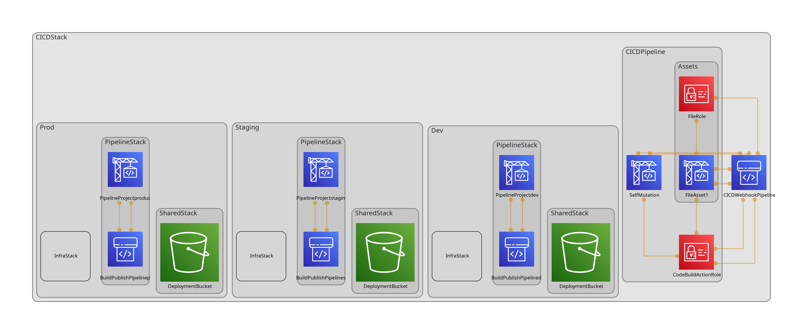

# Cross account CDK deployment 

This repo is an example of how you can do cross account cdk deployments.

It creates a CICD stack to update itself. This CICD stack then deploys N number of stacks in target accounts. In each account, It deploys 3 stacks. 

1. Shared Stack. This stack creates any resources shared between the next two stacks. This is done to avoid any circular dependency issues.

2. Infra stack. This stack creates everything you need to actually serve content.

3. Pipeline stack. This stack monitors the project repos specified in `./config.yml`, builds them when there is a change and deploys them to the target to be served by the Infra stack.

## Diagram

